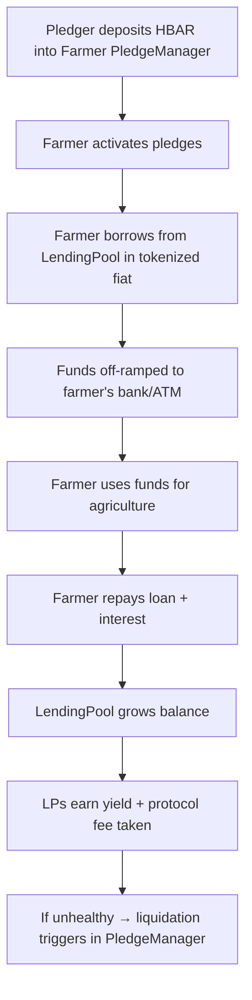

# Mavuno

**Empowering farmers through community-backed micro-lending on Hedera Hashgraph**

Mavuno is a decentralized micro-lending protocol designed to provide farmers in Africa with access to credit. Instead of requiring collateral, farmers are backed by pledgers who stake HBAR. Farmers borrow undercollateralized loans in tokenized local fiat from lending pools and access real cash directly through banks and ATM cards.

The system is transparent, secure, and designed to serve agriculture while enabling global pledgers to support local farmers.

---

## Contract Architecture

The Mavuno protocol is powered by three core contracts:

1. **FarmerRegistry** – Registers farmers and deploys their personal `PledgeManager`.
2. **PledgeManager** – Manages pledges of HBAR for each farmer.
3. **LendingPool** – Handles liquidity pools, borrowing, repayment, and liquidation.

---

## Contract Details

### 1. FarmerRegistry.sol

Registers farmers on-chain and links them to their off-chain profile (stored on IPFS). Each farmer automatically gets their own `PledgeManager` contract for handling pledges.

**Key Features**

* Register farmer profiles with IPFS metadata.
* Deploys a dedicated `PledgeManager` for each farmer.
* Maintains mapping of farmers → managers.
* Supports admin overrides for emergency profile updates.

**Events**

* `FarmerRegistered(address farmer, address pool, string profileUri, address manager)`
* `FarmerUpdated(address farmer, string profileUri)`

---

### 2. PledgeManager.sol

A **per-farmer contract** where pledgers stake HBAR in return for LP tokens (`fLP`). Farmers can activate or deactivate pledges, and liquidation flows through this contract.

**Key Features**

* Pledgers deposit HBAR → receive `fLP` tokens.
* Farmers can deactivate pledges, enabling withdrawal by pledgers.
* LendingPool can liquidate collateral if a farmer’s loan health is below threshold.
* Farmer can perform emergency withdrawals if no active loans exist.

**Events**

* `Pledged(address pledger, uint256 amount)`
* `Withdrawn(address pledger, uint256 amount)`
* `Liquidated(address farmer, address liquidator, uint256 amount)`
* `ActiveStatusChanged(bool active)`

---

### 3. LendingPool.sol

Handles all liquidity, loans, and repayments for a specific fiat-backed pool. Farmers borrow tokenized fiat against their pledges. LPs provide liquidity and earn interest.

**Key Features**

* **Liquidity Providers:**

  * `supply(amount, behalfOf)` – Deposit fiat, mint pool LP tokens (`pLP`).
  * `withdraw(amount)` – Burn `pLP` to withdraw fiat.
* **Borrowers (Farmers):**

  * `borrow(amount)` – Borrow fiat against pledges.
  * `repay(amount, behalfOf)` – Repay debt and accrued interest.
* **Liquidation:**

  * `liquidate(farmer)` – Triggered when health factor < threshold (96%).
  * Calls the farmer’s `PledgeManager` to seize pledged HBAR.
* **Parameters:**

  * Loan-to-Value (LTV): 70%
  * Borrow rate: 24% APR (2,400 BPS)
  * Liquidation threshold: 96%

**Events**

* `Supplied(address user, int64 amount, uint256 minted)`
* `Withdrawn(address user, int64 amount, uint256 burned)`
* `Borrowed(address farmer, int64 amount, int64 newPrincipal)`
* `Repaid(address farmer, int64 amount, int64 remaining, int64 interestPaid)`

---

## Protocol Flow

---

## Key Features Recap

* Community-backed pledging instead of collateral.
* Undercollateralized loans in tokenized local fiat.
* Direct bank/ATM access for farmers.
* Immutable, corruption-resistant, and transparent.
* Farmers can publish timelines and updates to attract pledgers.
* Farmers may set rewards for pledgers.

---

## Business Model

* **Protocol fees:** Small % of interest paid back in pools.
* **On/off-ramp fees:** Small fee for converting tokenized fiat.

---

## Tech Stack

* **Smart Contracts:** Solidity, Hedera Token Service, OpenZeppelin
* **Frontend:** React + TypeScript
* **Storage:** IPFS (farmer profiles)
* **Backend/Indexing:** Firebase (temporary), The Graph (upcoming)
* **UI:** TailwindCSS, Lucide Icons
* **Payments:** Paystack integration
