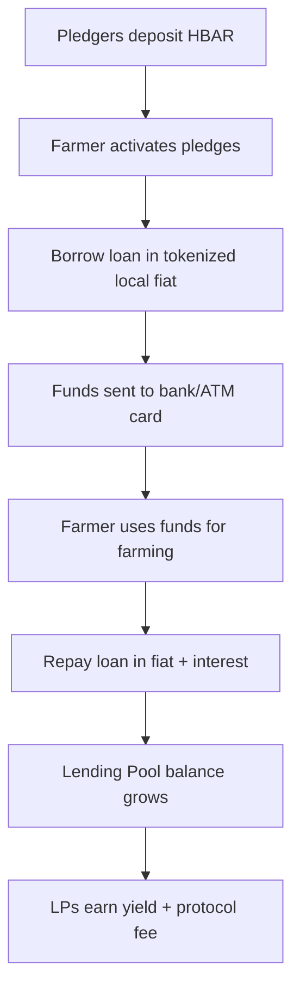

# Mavuno

**Empowering farmers through community-backed micro-lending on Hedera Hashgraph**

## Introduction

DeFi platforms like AAVE work well for crypto-native users but fail in agricultural contexts because farmers rarely hold capital to secure loans. Mavuno solves this problem using pledgers instead of collateral. Farmers get backing from a community, borrow from lending pools, and access real cash through local channels.

This system revives the traditional guarantor model common in African lending circles, but now made immutable, transparent, and borderless through Hedera.

---

## Smart Contract Logic

Mavuno is powered by three main contracts:

### 1. **FarmerRegistry.sol**

* Handles registration of farmers on the platform.
* Each farmer has a profile linked to their company and activity.
* Farmers can optionally complete KYC to get verified status.
* Tracks farmer timelines and updates to attract pledgers.

**Core Functions:**

* `registerFarmer(address farmer, string metadata)` – creates a farmer profile.
* `verifyFarmer(address farmer)` – marks a farmer as verified after KYC.
* `updateTimeline(address farmer, string activity)` – lets farmers update farming activity timelines.

---

### 2. **PledgeManager.sol**

* Replaces the collateral system used in AAVE.
* Pledgers deposit HBAR to back farmers.
* Farmers can activate or deactivate pledge usage.
* Pledgers can withdraw when pledge is inactive, and add more at any time.
* Tracks total pledge balances per farmer.

**Core Functions:**

* `pledge(address farmer, uint256 amount)` – pledger backs a farmer.
* `withdrawPledge(address farmer, uint256 amount)` – pledger withdraws when farmer has deactivated usage.
* `activatePledges(address farmer)` / `deactivatePledges(address farmer)` – farmer controls pledge usage.
* `getTotalPledges(address farmer)` – returns total backing for a farmer.

---

### 3. **LendingPool.sol**

* Manages pools for each supported African fiat.
* Farmers borrow tokenized fiat against total pledges.
* Loan-to-Value (LTV) ratio fixed at 70%.
* Liquidation happens at 96% to protect pool liquidity.
* LPs provide liquidity and earn interest from repayments.
* Protocol fee is collected from interest and repayment flows.

**Core Functions:**

* `deposit(uint256 amount)` – LP deposits fiat tokens into the pool and receives LP tokens.
* `borrow(address farmer, uint256 amount)` – farmer borrows against pledges.
* `repay(address farmer, uint256 amount)` – farmer repays loan + interest.
* `liquidate(address farmer)` – triggered if farmer’s loan health falls below threshold.
* `withdraw(uint256 lpTokens)` – LP withdraws underlying assets from the pool.

---

## Protocol Flow

---

## Business Model

* Small fee taken from interest repaid in pools.
* Small fee on on-ramp and off-ramp operations.
  
---

## Tech Stack

* **Frontend:** React + TypeScript
* **Smart Contracts:** Solidity + Hashgraph SDK + Ethers + Hardhat
* **Database/Auth:** Firebase (temporary)
* **UI:** TailwindCSS + Lucide Icons
* **Payments:** Paystack integration
* **Upcoming:** The Graph subgraph to replace Firebase for indexing
